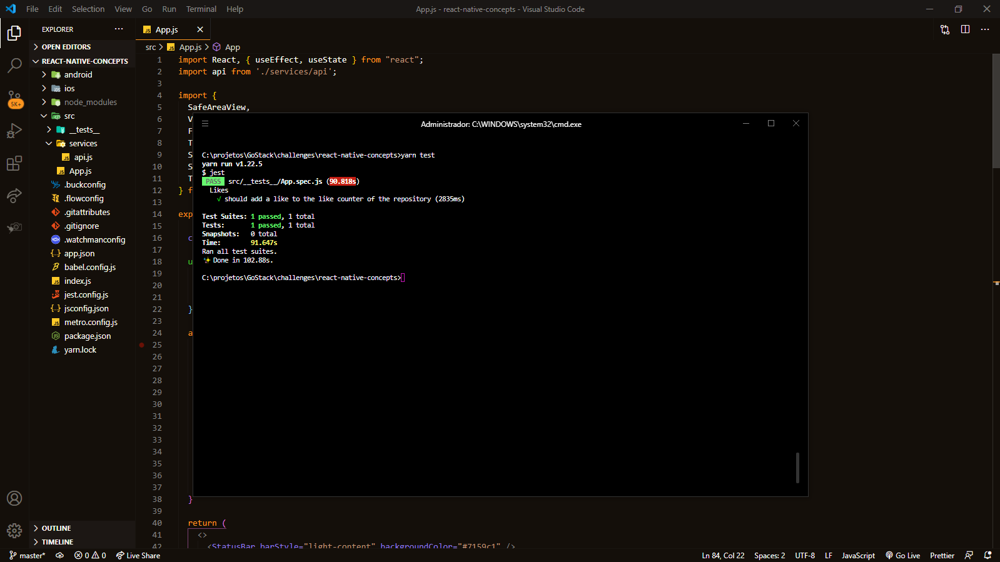

_English_

# React Native Concepts

🚀 About the challenge

In this challenge, I had to create an application to train everything I learned up to level 01 of React Native

The main objective of this challenge was to list the repositories of my API and create the functionality to enjoy the repository.

`Screenshot of tests`

---

_Português_

# Conceitos do React Native

🚀 Sobre o desafio

Nesse desafio, tive que criar um aplicativo para treinar tudo que aprendi até o nível 01 do React Native

O principal objetivo deste desafio era listar os repositórios da minha API e criar a funcionalidade de curtir um repositório.

`Captura de tela dos testes`

